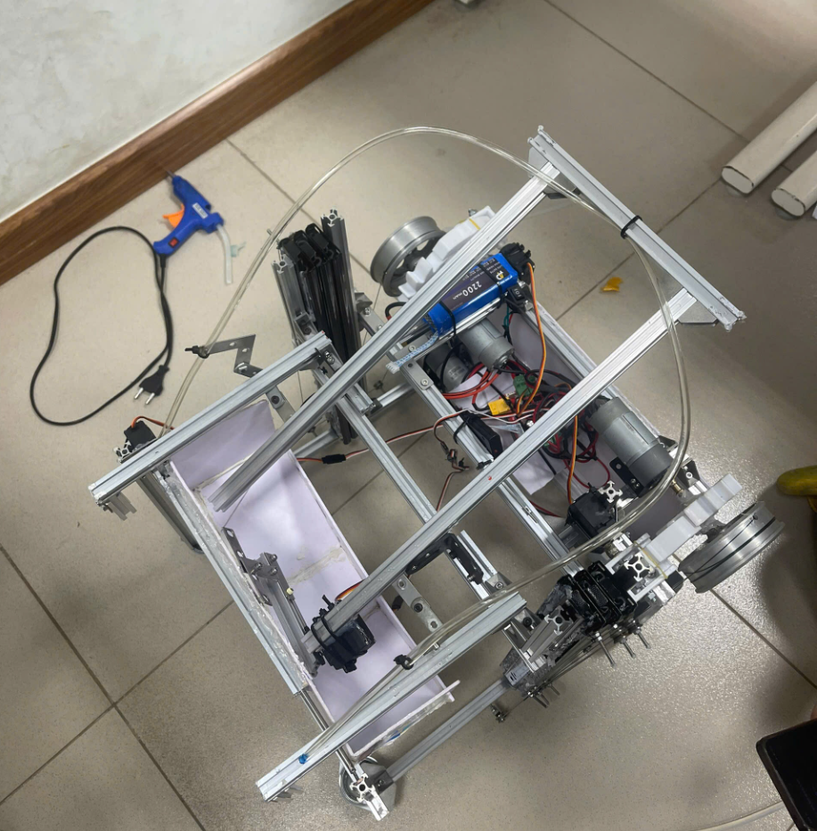

# ROBOT 2 BÁNH

Firmware điều khiển cho robot 2 bánh sử dụng VIA B và tay cầm PS2.



## Đặc điểm

- Hệ thống di chuyển 2 bánh với nhiều chế độ tốc độ và điều khiển
- Cơ cấu nâng hạ dùng động cơ DC với chốt hãm servo
- Hệ thống phanh thông minh và kiểm soát gia tốc
- Điều khiển servo 180° và 360° cho các cơ cấu phụ trợ

## Cấu trúc thư mục

```
2_wheels/
  ├── 2_wheels.ino        # File chính Arduino
  ├── config.h            # Cấu hình chân và thông số
  ├── PS2_controller.cpp  # Xử lý tay cầm PS2
  ├── PS2_controller.h    # Header xử lý tay cầm PS2
  ├── robot_mechanisms.cpp # Điều khiển cơ cấu robot
  └── robot_mechanisms.h  # Header điều khiển cơ cấu
```

## Sơ đồ kết nối

### Kết nối tay cầm PS2
- PS2_DAT_PIN: 12
- PS2_CMD_PIN: 13
- PS2_SEL_PIN: 15
- PS2_CLK_PIN: 14

### Kết nối động cơ (qua PCA9685)
- Động cơ trái: Kênh 8 (IN1) và 9 (IN2)
- Động cơ phải: Kênh 10 (IN1) và 11 (IN2)
- Động cơ nâng hạ: Kênh 14 (IN1) và 15 (IN2)
- Động cơ phụ trợ: Kênh 12 (IN1) và 13 (IN2)

### Kết nối servo (qua PCA9685)
- Servo 180° chính: Kênh 2 (không dùng khi thi đấu)
- Servo 360°: Kênh 3
- Servo 180° phụ: Kênh 4 (không dùng khi thi đấu)
- Servo 360B°: Kênh 5
- Servo 180° chốt trái: Kênh 6
- Servo 180° chốt phải: Kênh 7

## Hệ thống di chuyển

### Điều khiển di chuyển
- **Joystick trái (PSS_LY)**: Di chuyển tiến/lùi (Throttle)
- **Joystick trái (PSS_LX)**: Điều khiển rẽ trái/phải (Steering)
- **L1 (PSB_L1)**: Chế độ xoay tại chỗ (QuickTurn)
- **R1 (PSB_R1)**: Chế độ di chuyển chậm (Slow Mode)
- **R2 (PSB_R2)**: Chế độ di chuyển nhanh (Nitro Mode)

### Chế độ di chuyển
- **Chế độ thường**: 50% tốc độ tối đa
- **Chế độ nhanh (R2)**: 95% tốc độ tối đa
- **Chế độ chậm (R1)**: 20% tốc độ tối đa
- **Chế độ xoay tại chỗ (L1)**: Xoay với 80% công suất

### Hệ thống phanh thông minh
Robot được trang bị hệ thống phanh thông minh kích hoạt khi:
- Nhả ga nhanh (>30% thay đổi)
- Phanh với 60% công suất trong 30ms
- Hỗ trợ phanh khi rẽ để tăng tính ổn định

### Xử lý đầu vào
- Lọc vùng chết (deadband) 1% để loại bỏ nhiễu joystick
- Điều chỉnh độ nhạy lái dựa vào tốc độ (giảm độ nhạy khi di chuyển nhanh)
- Hệ số làm mịn gia tốc 5% để tránh giật khi tăng/giảm tốc

## Điều khiển cơ cấu

### Điều khiển nâng hạ
- **Joystick phải lên/xuống (PSS_RY)**: Nâng lên/hạ xuống
- **R2 + Joystick phải**: Chế độ nâng nhanh (100% công suất)
- **L3 + R3**: Bật/tắt tính năng tự động đóng/mở chốt hãm khi nâng/hạ

### Điều khiển servo và chốt hãm
- **O (Circle)**: Quay servo 360° (kênh 3) theo chiều kim đồng hồ
- **X (Cross)**: Quay servo 360° (kênh 3) ngược chiều kim đồng hồ
- **PAD_DOWN**: Quay servo 360B° (kênh 5) theo chiều kim đồng hồ
- **PAD_UP**: Quay servo 360B° (kênh 5) ngược chiều kim đồng hồ
- **PAD_RIGHT**: Đóng chốt hãm servo (khóa cơ cấu nâng)
- **PAD_LEFT**: Mở chốt hãm servo (mở khóa cơ cấu nâng)
- **Triangle (Tam giác)**: Điều khiển servo 180B° (kênh 4) giữa vị trí 0° và 45°
- **Square (Vuông)**: Điều khiển servo 180° (kênh 2) giữa vị trí 0° và 90°

## Tùy chỉnh

Bạn có thể tùy chỉnh các thông số trong file `config.h`:

### Điều chỉnh tốc độ
```c
#define NORM_DRIVE_SPEED_FACTOR 0.5   // 50% tốc độ thường
#define TOP_DRIVE_SPEED_FACTOR 0.95   // 95% tốc độ tối đa (R2)
#define PRECISION_DRIVE_SPEED_FACTOR 0.20  // 20% tốc độ chậm (R1)
#define QUICKTURN_SENSITIVITY 0.8     // 80% công suất khi xoay tại chỗ
```

### Điều chỉnh độ nhạy
```c
#define INPUT_DEADBAND 0.01         // Ngưỡng chết 1%
#define THROTTLE_SENSITIVITY 1.0    // Độ nhạy ga
#define STEERING_SENSITIVITY 1.0    // Độ nhạy lái
#define TURN_GAIN 0.5               // Giảm độ nhạy rẽ 50% khi chạy nhanh
#define MIN_TURN_SENSITIVITY 0.4f   // Độ nhạy tối thiểu khi chạy nhanh (40%)
```

### Điều chỉnh hệ thống phanh
```c
#define BRAKE_DETECTION_THRESHOLD 0.3f  // Kích hoạt phanh khi nhả ga nhanh >30%
#define BRAKE_POWER_FACTOR 0.6f       // Phanh với 60% công suất
#define BRAKE_DURATION_MS 30          // Phanh trong 30ms
```

### Điều chỉnh động cơ nâng hạ
```c
#define AUX_MOTOR_SPEED 3000        // Tốc độ nâng hạ ~73% (3000/4095)
#define LOWERING_SPEED_FACTOR 0.11f  // Tốc độ hạ xuống ~11% để tránh rơi tự do
#define NITRO_HANGING_SPEED_FACTOR 1.0f   // 100% công suất cho chế độ treo
```

## Gỡ lỗi

Firmware bao gồm các tùy chọn debug có thể được kích hoạt trong `config.h`:

```c
#define DEBUG_PS2_VALUES       // Hiển thị giá trị joystick
#define DEBUG_DRIVE_OUTPUT     // Hiển thị giá trị PWM động cơ
#define DEBUG_SERVO            // Hiển thị thông tin servo
#define DEBUG_MOTOR            // Hiển thị thông tin motor
```

## Lưu ý

- Đảm bảo các cấu hình chân trong config.h khớp với kết nối phần cứng
- Kiểm tra kỹ cực tính kết nối động cơ và servo trước khi cấp nguồn
- Nếu robot di chuyển không đúng hướng, hãy đảo dây hoặc thay đổi cấu hình trong code
- Có thể hiệu chỉnh điểm dừng servo 360° nếu servo bị trôi khi dừng
- Tính năng tự động đóng/mở chốt hãm có thể được bật/tắt bằng tổ hợp L3+R3 