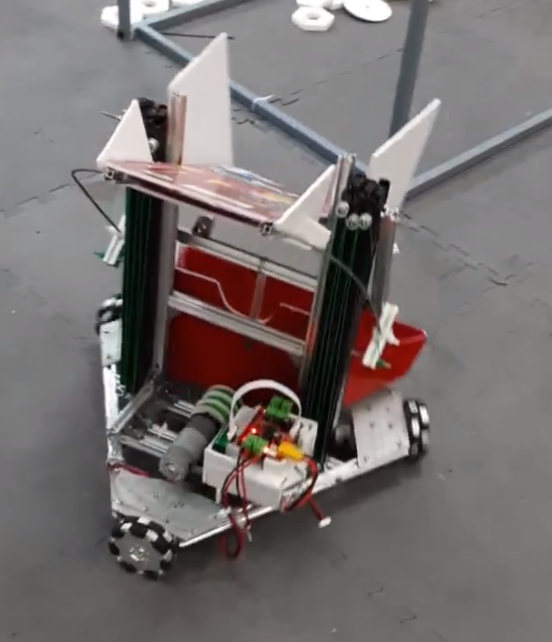

# ROBOT 3 BÁNH TOÀN HƯỚNG

Firmware điều khiển cho robot 3 bánh toàn hướng (Omni) sử dụng VIA B "Bánh Mì" và tay cầm PS2.



## Đặc điểm

- Hệ thống di chuyển 8 hướng với 3 bánh Omni
- Chế độ di chuyển chậm cho điều khiển chính xác
- Cơ cấu nâng hạ sử dụng động cơ DC
- Hệ thống thả bóng sử dụng servo 180° và 360°
- Hệ thống giảm tốc thích ứng

## Cấu trúc thư mục

```
3_wheels/
  ├── 3_wheels.ino        # File chính Arduino
  ├── config.h            # Cấu hình chân và thông số
  ├── PS2_controller.cpp  # Xử lý tay cầm PS2
  ├── PS2_controller.h    # Header xử lý tay cầm PS2
  ├── robot_mechanisms.cpp # Điều khiển cơ cấu robot
  └── robot_mechanisms.h  # Header điều khiển cơ cấu
```

## Sơ đồ kết nối

### Kết nối động cơ (qua PCA9685)
- Động cơ bánh trước bên trái: Kênh 8 (IN1) và 9 (IN2)
- Động cơ bánh trước bên phải: Kênh 10 (IN1) và 11 (IN2)
- Động cơ bánh sau: Kênh 14 (IN1) và 15 (IN2)
- Động cơ nâng hạ: Kênh 12 (IN1) và 13 (IN2)

### Kết nối servo (qua PCA9685)
- Servo thả bóng (360°): Kênh 2
- Servo thả bóng dự phòng (180°): Kênh 3

## Hướng dẫn sử dụng

### Điều khiển di chuyển
- Joystick trái: Di chuyển robot theo 8 hướng
- Joystick phải (trái/phải): Xoay robot tại chỗ
- R1: Chế độ di chuyển chậm

### Điều khiển cơ cấu
- Nút O (Circle): Nâng lên
- Nút X (Cross): Hạ xuống
- PAD_UP: Mở servo thả bóng
- PAD_DOWN: Đóng servo thả bóng

## Tính năng đặc biệt

### Di chuyển toàn hướng
Robot sử dụng hệ thống 3 bánh omni cho phép di chuyển theo 8 hướng:
- Tiến thẳng (North)
- Chéo trước-phải (North-East)
- Ngang phải (East)
- Chéo sau-phải (South-East)
- Lùi (South)
- Chéo sau-trái (South-West)
- Ngang trái (West)
- Chéo trước-trái (North-West)

### Hệ thống giảm tốc thích ứng
Robot được trang bị hệ thống giảm tốc thông minh:
- Giảm tốc tỷ lệ với vận tốc hiện tại
- Điều chỉnh giảm tốc khi đang nâng/hạ
- Ngưỡng tốc độ tối thiểu để tránh rung lắc

### Hệ thống bảo vệ động cơ
- Dead time 2ms khi đảo chiều để bảo vệ mạch công suất
- Làm mượt chuyển động với giới hạn gia tốc

## Tùy chỉnh

Bạn có thể tùy chỉnh các thông số trong file `config.h`:

### Điều chỉnh tốc độ
```c
#define MAX_DRIVE_SPEED_FACTOR 0.5   // 50% tốc độ tối đa cho di chuyển
#define MAX_ROTATION_SPEED_FACTOR 0.35 // 35% tốc độ tối đa cho quay tại chỗ
#define SLOW_MODE_FACTOR 0.4f         // 40% tốc độ tối đa khi ở chế độ chậm
```

### Điều chỉnh giảm tốc
```c
#define STOP_DECELERATION_BASE 0.01f   // Hệ số giảm tốc cơ bản
#define STOP_DECELERATION_SCALE 0.08f  // Hệ số tỷ lệ giảm tốc theo vận tốc
```

### Điều chỉnh servo
```c
#define SERVO_MIN_PULSE 125   // Xung tối thiểu (~0°)
#define SERVO_MAX_PULSE 575   // Xung tối đa (~180°)
```

### Điều chỉnh động cơ nâng hạ
```c
#define LIFT_MOTOR_SPEED 3700         // Tốc độ mặc định (0-4095)
#define LIFT_MOTOR_ACCELERATION_FACTOR 0.03f  // Giới hạn gia tốc motor nâng hạ
#define MAX_LIFT_SPEED_FACTOR 1.0f    // Hệ số tốc độ tối đa cho motor nâng hạ (100%)
```

## Gỡ lỗi

Firmware bao gồm các tùy chọn debug có thể được kích hoạt trong `config.h`:

```c
#define DEBUG_PS2_VALUES       // Hiển thị giá trị joystick
#define DEBUG_DRIVE_OUTPUT     // Hiển thị giá trị PWM động cơ
#define DEBUG_SERVO            // Hiển thị thông tin servo
#define DEBUG_MOTOR            // Hiển thị thông tin motor
```

## Lưu ý

- Đảm bảo các cấu hình chân trong config.h khớp với kết nối phần cứng
- Kiểm tra kỹ cực tính kết nối động cơ và servo trước khi cấp nguồn
- Nếu robot di chuyển không đúng hướng, hãy đảo dây hoặc thay đổi cấu hình trong code 